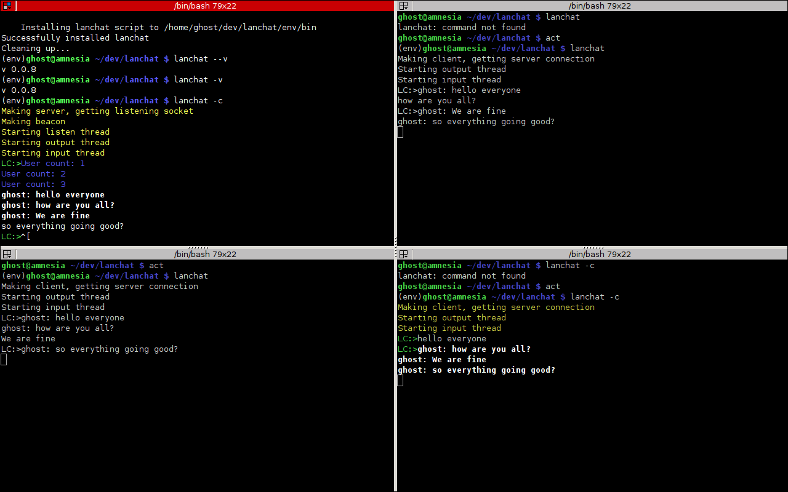

lanchat
====

[](http://badge.fury.io/py/lanchat)

A LAN chatting program in python based on goodwill. It does not need a special
server setup. Install on clients and just run.

Things you should know
----------------------

- No selecting a server( finds it on it's own)
- New server selected if current goes down
- Printing is wierd ( Can someone help me fix it?)
- No encryption (boo)
- No protection against DOS
- Picks your username from the shell
    * You can change it though
    * ```
         from lanchat import chat
         n = chat.Node()
         n.name='FooBar'
         n.run()
      ```

- It's **pseudo-distributed** . It actually uses a server-client model of communication
  but does so in a manner that everyone just ends up seeing the client.


**Note** : In case the chat does not run check that you are allowed to do UDP broadcast on the network.


Install
-------

```
$ virtualenv -p python3 env
$ source enb/bin/activate
$ pip install lanchat
```

How to use
----------

```
$ lanchat
$ lanchat --version
```

`$ lanchat -c` for the coloured version of the software.


